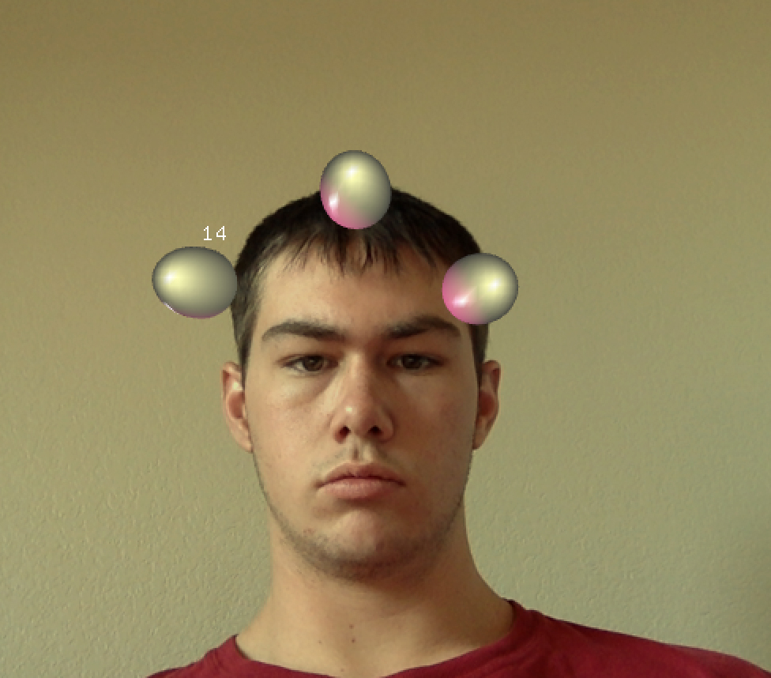

##Head Piece
This project generates 3 moving spheres at three different positions on the persons head; one top and centered on the forhead and two offset to the outside of each eye. As the person moves face tracking moves the spheres to be positioned appropriately.  The facial tracking is down with the ofxCV addon.

The spheres are moving on a set x y postioning set up in correlation to the rectangle doing the "face tracking."
lft is currently set at 0.01

    posx+=lft;
    posx2-=lft;
    posy+=lft;
    posy2-=lft;
    if((posx>=0.9)||(posx<=0.4)){
        lft*=-1;
    }
    if((posx2>=0.6)||(posx2<=0.1)){
        lft*=-1;
    }
    if((posx3>=0.6)||(posx3<=-0.6)){
        lft*=-1;
    }
    if((posy>=0.25)||(posy<=0.05)){
        lft*=-1;
    }
    if((posy2>=0.25)||(posy2<=0.05)){
        lft*=-1;
    }
    if((posy3>=-0.25)||(posy3<=0)){
        lft*=-1;
    }

Here each sphere uses a copy of this code with changes made to its position in order to give the triangle shape.

for(int i = 0; i < finder.size(); i++) {
            ofRectangle object = finder.getObjectSmoothed(i);
            sunglasses.setAnchorPercent(.5, .5);
            float scaleAmount = .90 * object.width / 					sunglasses.getWidth();
            ofPushMatrix();
            ofTranslate(object.x + object.width * 1.75 * posx, 			object.y + object.height * posy);
            ofScale(scaleAmount, scaleAmount);
            sphere.draw();
            ofPopMatrix();
            ofPushMatrix();
            ofTranslate(object.getPosition());
            ofDrawBitmapStringHighlight(ofToString(finder.getLabel(i)), 0, 0);
            ofLine(ofVec2f(), toOf(finder.getVelocity(i)) * 10);
            ofPopMatrix();
        }